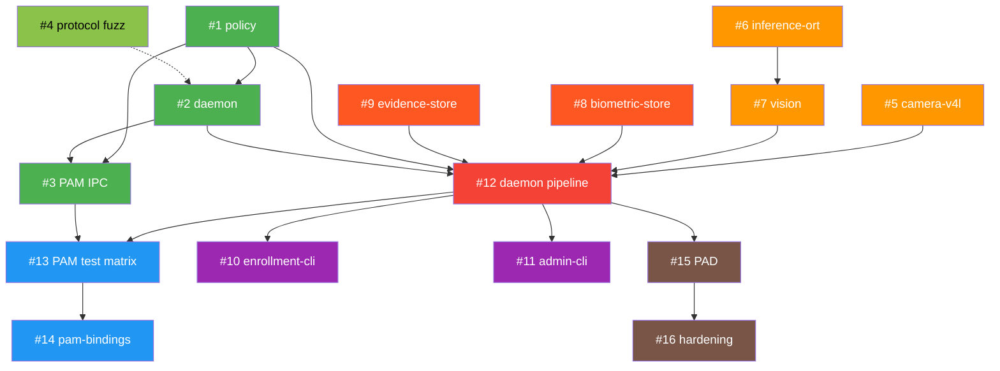
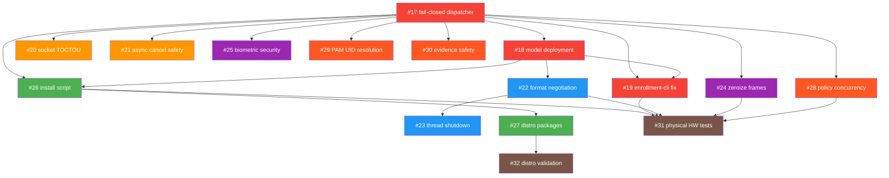

# soos — Complete Development Backlog

Comprehensive issue backlog derived from `ARCHITECTURE.md` §11 implementation phases,
`VERIFICATION_MATRIX.md` acceptance criteria, and gap analysis of current codebase.

> **Generated**: 2026-09-13  
> **Status**: Approved  
> **Execution order**: Critical path #1 → #2 → #3, then parallel phases

---

## Current State Assessment

### ✅ Completed (Foundation)
| Component | Status | Details |
|-----------|--------|---------|
| **Workspace** | ✅ Complete | `resolver="2"`, `deny.toml`, `rust-toolchain.toml` |
| **`protocol` crate** | ✅ Complete | Types, codec v1, round-trip tests, bounded validation |
| **`pam` crate** | ✅ Skeleton | `PAM_IGNORE` stub, `catch_unwind`, C ABI exports |
| **Invariant tests** | ✅ Solid | `forbid(unsafe)`, no-unwrap, no-tokio, no-opencv, no-secrets |
| **CI/CD** | ✅ Complete | GitHub Actions: quality + security + PAM Docker |
| **Tooling** | ✅ Complete | `save.sh`, `run_tests.sh`, `candid_review.sh`, `pr_loop.sh` |
| **Documentation** | ✅ Complete | Architecture, ADR, Mock Strategy, Verification Matrix, 10 walkthroughs |

### 🔴 Remaining (9 crates, all core functionality)
`policy`, `daemon`, `camera-v4l`, `vision`, `inference-ort`, `biometric-store`, `evidence-store`, `enrollment-cli`, `admin-cli`

---

## Phase 1 — Hardened IPC (Foundation → Real Communication)

> **Goal**: Transform the PAM module from a skeleton into a functional IPC client, and create the daemon skeleton that accepts connections.

---

### Issue #1: `policy` Crate — Authorization Logic (Zero I/O)

> **Branch**: `feat/policy-crate`  
> **Architecture ref**: §3 Request State Matrix, §11 Phase 1  
> **VERIFICATION_MATRIX**: PO1, PO2, PO3, PO4

Pure business logic crate: takes structured inputs (score, PAD result, UID context, rate-limit state) and renders a `Verdict`. Zero filesystem, zero network, zero async.

#### Sub-issues:

- [x] **#1.1** — Scaffold `crates/policy/` with `Cargo.toml`, `#![forbid(unsafe_code)]`, workspace membership
  - Acceptance: `PO4` — `forbid(unsafe_code)` invariant test passes
  - Acceptance: `PO3` — zero I/O deps in `Cargo.toml` (no `std::fs`, `std::net`, `tokio`)

- [x] **#1.2** — Implement `AuthorizationDecision` engine
  - Input: `AuthContext { score: f32, pad_passed: bool, face_count: u8, uid: u32, session_valid: bool }`
  - Output: `(Verdict, ReasonClass)` from `protocol` types
  - Rules: `Allow` only if `score >= threshold AND pad_passed AND face_count == 1 AND session_valid`
  - Acceptance: `PO1` — parametric unit tests cover every branch

- [x] **#1.3** — Implement per-UID rate limiter
  - Sliding window or token-bucket, configurable `max_attempts` and `window_secs`
  - Must be `no_std`-compatible (no system clock — accepts monotonic timestamp as parameter)
  - Acceptance: `PO2` — burst test: 10 rapid requests from same UID, only first N pass

- [x] **#1.4** — Implement cosine threshold configuration
  - `ThresholdConfig { match_threshold: f32, pad_threshold: f32 }` with builder pattern
  - Sane defaults documented from MobileFaceNet literature

---

### Issue #2: `daemon` Crate — Socket Listener Skeleton

> **Branch**: `feat/daemon-skeleton`  
> **Architecture ref**: §4 IPC Architecture, §10 Daemon Hardening  
> **VERIFICATION_MATRIX**: D1, D2, D3, D4, D5

#### Sub-issues:

- [x] **#2.1** — Scaffold `crates/daemon/` with `Cargo.toml` (binary crate), add `tokio` workspace dep
  - `[[bin]] name = "soos-daemon"`
  - Dependencies: `tokio`, `soos-protocol`, `soos-policy`, `nix` (for `SO_PEERCRED`)

- [x] **#2.2** — Implement socket lifecycle manager
  - Validate `/run/soos/` ownership (root:soos, not world-writable, not symlink)
  - Unlink stale socket after `lstat` verification
  - Bind `/run/soos/daemon.sock` with mode `0660`
  - Acceptance: `D1` — socket created with correct permissions

- [x] **#2.3** — Implement `SO_PEERCRED` connection handler
  - On every `accept()`: extract `peer.uid`, `peer.pid` via `getsockopt(SO_PEERCRED)`
  - Cross-reference against target UID from request
  - Acceptance: `D2` — spoofed UID test rejects mismatched peer

- [x] **#2.4** — Implement connection dispatcher with bounded concurrency
  - `tokio::sync::Semaphore` capping concurrent connections (configurable, default 8)
  - Per-connection timeout enforcement
  - Read framed request → validate → dispatch to (stubbed) handler → write framed response

- [x] **#2.5** — Implement health check subsystem
  - Internal struct tracking `socket_ready: bool`, `camera_ready: bool`, `models_verified: bool`
  - Exposed via admin socket or structured logging
  - Acceptance: `D4` — health check reports component readiness

- [x] **#2.6** — Create systemd unit file `packaging/soos-daemon.service`
  - Full sandbox: `NoNewPrivileges`, `PrivateTmp`, `ProtectHome`, `ProtectSystem=strict`, `RestrictAddressFamilies=AF_UNIX`, etc.
  - `RuntimeDirectory=soos`, `RuntimeDirectoryMode=0750`
  - Acceptance: `D3` — systemd restrictions active

- [x] **#2.7** — Implement structured logging with sensitive-data filter
  - Log framework: `tracing` + `tracing-subscriber`
  - MUST never log: frames, embeddings, passwords, raw request payloads
  - Log: connection accepted (peer_uid, pid), verdict rendered, error class
  - Acceptance: `D5` — log audit finds zero sensitive information

---

### Issue #3: PAM Module — IPC Client Integration

> **Branch**: `feat/pam-ipc-client`  
> **Architecture ref**: §5 PAM Module, §4 Async Boundaries  
> **VERIFICATION_MATRIX**: PA1, PA2, PA7, PA8

#### Sub-issues:

- [x] **#3.1** — Implement synchronous IPC client in `crates/pam/src/ipc.rs`
  - `std::os::unix::net::UnixStream::connect()` with `set_read_timeout` / `set_write_timeout`
  - Total budget: 200–250ms (configurable via PAM module argument `timeout_ms=250`)
  - Generate `request_id` via `getrandom` crate (no openssl)
  - Send framed `Request`, receive framed `Response`
  - Close socket immediately after response

- [x] **#3.2** — Integrate IPC client into `pam_sm_authenticate`
  - Parse `timeout_ms` from `argv`
  - Connect → send AuthAttempt → receive verdict → map to `PAM_SUCCESS` or `PAM_IGNORE`
  - All errors (connect fail, timeout, malformed response) → `PAM_IGNORE`

- [x] **#3.3** — Implement `event=password-failed` mode
  - When `argv` contains `event=password-failed`: send `Event::PasswordFailed` to daemon (best-effort, fire-and-forget)
  - 20ms timeout, zero blocking of PAM stack
  - Used in 3rd position of PAM stack (after `pam_unix` failure)

- [x] **#3.4** — Dockerized pamtester validation
  - T1: `.so` loadable by Linux-PAM → `pamtester` reports module found
  - T2: `pam_sm_authenticate` returns `PAM_IGNORE` when daemon is offline → password prompt works
  - T3: Removing `.so` from PAM config → auth still works (non-interference)
  - Acceptance: `PA1`, `PA7`, `PA8`

---

### Issue #4: Protocol Fuzzing

> **Branch**: `test/protocol-fuzzing`  
> **Architecture ref**: VERIFICATION_MATRIX P5

#### Sub-issues:

- [x] **#4.1** — Add `cargo-fuzz` harness for `decode::<Request>`
  - Feed arbitrary bytes, assert zero panics over 10M iterations
  - Acceptance: `P5`

- [x] **#4.2** — Add `cargo-fuzz` harness for `decode::<Response>`
  - Same coverage target

- [x] **#4.3** — Add `proptest` round-trip property test
  - Generate arbitrary valid `Request` values → encode → decode → assert equality

---

## Phase 2 — Camera Pipeline

> **Goal**: Warm V4L2 MMAP streaming with mock support for CI.

---

### Issue #5: `camera-v4l` Crate — V4L2 Capture Manager

> **Branch**: `feat/camera-v4l`  
> **Architecture ref**: §6 Warm Camera Streaming  
> **VERIFICATION_MATRIX**: C1, C2, C3, C4, C5

#### Sub-issues:

- [x] **#5.1** — Scaffold `crates/camera-v4l/` with `Cargo.toml`
  - Dependencies: `v4l = "0.14"`, `arc-swap`
  - Feature flag: `mock-camera = []`

- [x] **#5.2** — Define `CameraManager` trait
  - `fn latest_frame(&self) -> Option<Arc<Frame>>`
  - `fn is_ready(&self) -> bool`
  - `Frame` struct: `data: Vec<u8>`, `width: u32`, `height: u32`, `timestamp_mono_ns: u64`, `format: PixelFormat`

- [x] **#5.3** — Implement `V4lCameraManager` (production)
  - Open device by `/dev/v4l/by-id/...` path (configurable)
  - MMAP streaming with buffer rotation
  - Dedicated blocking thread, `ArcSwap<Frame>` for lock-free reads
  - Discard first 15–30 frames for auto-exposure stabilization
  - Acceptance: `C4`, `C5`

- [x] **#5.4** — Implement `MockCameraManager` (behind `mock-camera` feature)
  - Generate static 640×480 test frames with monotonic timestamps
  - Simulate device errors: `ENODEV`, `EIO`, `EBUSY`
  - Simulate frame starvation (no new frame for N ms)
  - Acceptance: `C1`

- [x] **#5.5** — Implement error recovery with bounded backoff
  - Handle `ENODEV` / `EIO` / `EBUSY` without panic
  - Exponential backoff: 100ms → 200ms → 400ms → cap at 5s
  - Report `Unavailable` to IPC during recovery
  - Acceptance: `C3`

- [x] **#5.6** — Implement idle power management
  - Drop to 5 FPS after 60s of inactivity
  - Resume full FPS on next auth request
  - Acceptance: `C2` (frame available in < 5ms via `ArcSwap`)

---

## Phase 3 — Vision Engine

> **Goal**: Full face detection → alignment → embedding → matching pipeline.

---

### Issue #6: `inference-ort` Crate — ONNX Runtime Wrapper

> **Branch**: `feat/inference-ort`  
> **Architecture ref**: §7 Vision Pipeline

#### Sub-issues:

- [x] **#6.1** — Scaffold `crates/inference-ort/` with `Cargo.toml`
  - Dependencies: `ort = "2.0"` (CPU execution provider only)
  - NO OpenCV dependency (invariant test)

- [x] **#6.2** — Implement `ModelRegistry` with manifest verification
  - Parse `models/manifest.toml`: model ID, license, source URL, SHA-256 checksum
  - Verify checksums at daemon startup before loading any session
  - Acceptance: Global invariant — ONNX model attested by manifest + SHA-256

- [x] **#6.3** — Implement `FaceDetector` (UltraFace Slim 320)
  - Input: raw pixel buffer (RGB, 320×240 or 640×480)
  - Output: `Vec<BoundingBox>` with confidence scores
  - Deterministic Rust NMS (Non-Maximum Suppression)

- [x] **#6.4** — Implement `LandmarkDetector` (5-point landmarks)
  - Input: face crop from bounding box
  - Output: 5 landmark points (eye centers, nose tip, mouth corners)

- [x] **#6.5** — Implement `EmbeddingExtractor` (MobileFaceNet)
  - Input: aligned 112×112 face crop
  - Output: L2-normalized 128D or 512D embedding vector
  - Acceptance: `V2` — norm ≈ 1.0 for all outputs

- [x] **#6.6** — Create `models/manifest.toml` with checksums
  - UltraFace Slim 320 ONNX
  - 5-point landmark ONNX
  - MobileFaceNet ArcFace ONNX
  - Document license, source URL, expected input/output shapes

---

### Issue #7: `vision` Crate — Preprocessing & Matching

> **Branch**: `feat/vision-crate`  
> **Architecture ref**: §7 Models & Verification Pipeline  
> **VERIFICATION_MATRIX**: V1, V2, V3, V4, V5, V6

#### Sub-issues:

- [x] **#7.1** — Scaffold `crates/vision/` with `Cargo.toml`, `#![forbid(unsafe_code)]`
  - Dependencies: `soos-inference-ort`, `soos-protocol`
  - Acceptance: `V6` — `forbid(unsafe_code)` enforced

- [x] **#7.2** — Implement color conversion (YUYV/MJPEG → RGB)
  - Pure Rust, no OpenCV
  - Support common V4L2 output formats

- [x] **#7.3** — Implement affine alignment from 5-point landmarks
  - Standard alignment transform → 112×112 crop
  - Golden test fixtures: known input image → expected aligned output
  - Acceptance: `V1` — golden tests match training pipeline

- [x] **#7.4** — Implement cosine similarity matcher
  - `fn cosine_similarity(a: &[f32], b: &[f32]) -> f32`
  - Known-vector distance tests with precomputed expected values
  - Acceptance: `V3` — correctness verified

- [x] **#7.5** — Implement `VisionPipeline` orchestrator
  - detect → count faces → align → extract embedding → match
  - Reject if 0 or > 1 face detected
  - Acceptance: `V4` — rejection tests for 0 and multi-face

- [x] **#7.6** — Benchmark: full pipeline < 150ms p95
  - On reference hardware (document specs)
  - Acceptance: `V5` — latency budget met

- [x] **#7.7** — Create test fixtures in `tests/fixtures/`
  - Sample facial images (known subjects, unknown subjects)
  - Pre-computed embeddings for regression testing
  - Multi-face and no-face images for rejection tests

---

## Phase 4 — Storage & Evidence

> **Goal**: Encrypted persistence for biometric templates and intrusion evidence.

---

### Issue #8: `biometric-store` Crate — Encrypted Embeddings

> **Branch**: `feat/biometric-store`  
> **Architecture ref**: §9 Privacy & Persistence  
> **VERIFICATION_MATRIX**: B1, B2, B3, B4

#### Sub-issues:

- [x] **#8.1** — Scaffold `crates/biometric-store/` with `Cargo.toml`
  - Dependencies: `aes-gcm`, `serde`, `cbor`, `zeroize`

- [x] **#8.2** — Implement AES-GCM encryption/decryption for embeddings
  - Key derivation from daemon master key (or hardware-backed key)
  - Unique nonce per template write
  - Acceptance: `B1` — encrypted at rest

- [x] **#8.3** — Implement file storage at `/var/lib/soos/biometrics/<uid>.cbor.enc`
  - Mode `0600`, owner `root:root`
  - Atomic writes (write to `.tmp` → `rename`)
  - Acceptance: `B2` — permissions correct

- [x] **#8.4** — Implement metadata storage with each template
  - `model_id`, `model_version`, `enrollment_timestamp`, `embedding_dim`
  - Acceptance: `B3` — model version tracked for migration

- [x] **#8.5** — Implement CRUD operations
  - Enroll (create/replace), verify (read + compare), delete, list enrolled UIDs
  - Acceptance: `B4` — full CRUD tested

- [x] **#8.6** — Implement zeroization on drop
  - All decrypted embedding vectors use `Zeroizing<Vec<f32>>`
  - Raw frames deleted immediately after extraction

---

### Issue #9: `evidence-store` Crate — Anti-Intrusion Snapshots

> **Branch**: `feat/evidence-store`  
> **Architecture ref**: §9 Evidence Snapshots  
> **VERIFICATION_MATRIX**: E1, E2, E3, E4, E5

#### Sub-issues:

- [x] **#9.1** — Scaffold `crates/evidence-store/` with `Cargo.toml`

- [x] **#9.2** — Implement opt-in configuration
  - Disabled by default in daemon config
  - Acceptance: `E1` — disabled by default

- [x] **#9.3** — Implement encrypted evidence storage
  - Path: `/var/lib/soos/evidence/YYYY-MM-DD/<uuid>.webp.enc`
  - Mode `0600`, owner `root:root`
  - Acceptance: `E4` — correct permissions

- [x] **#9.4** — Implement 7-day retention rotation
  - Cron-like cleanup: delete evidence directories older than 7 days
  - Acceptance: `E2` — automatic rotation

- [x] **#9.5** — Implement per-UID daily cap
  - Configurable max snapshots per UID per day (default: 10)
  - Acceptance: `E3` — daily cap enforced

- [x] **#9.6** — Ensure zero network transmission
  - No network dependency in `Cargo.toml`
  - Invariant test: crate has no `std::net`, no `tokio::net`, no `reqwest`
  - Acceptance: `E5` — dependency audit passes

---

## Phase 5 — Enrollment & Admin CLI

> **Goal**: User-facing tools for enrollment and system diagnostics.

---

### Issue #10: `enrollment-cli` — Root Enrollment Tool

> **Branch**: `feat/enrollment-cli`  
> **Architecture ref**: §8 Monorepo Structure

#### Sub-issues:

- [x] **#10.1** — Scaffold `crates/enrollment-cli/` with `Cargo.toml` (binary)
  - Dependencies: `clap`, `soos-protocol`, `soos-biometric-store`, `soos-inference-ort`, `soos-camera-v4l`

- [x] **#10.2** — Implement `enroll` command
  - Must be run as root
  - Capture N frames → select best quality → extract embedding → encrypt → store
  - Interactive confirmation with enrollment summary

- [x] **#10.3** — Implement `delete` command
  - Delete enrollment for specified UID
  - Secure erasure of stored template

- [x] **#10.4** — Implement `verify` command (diagnostic)
  - One-shot capture → detect → match against stored template
  - Report: score, face count, PAD result, latency breakdown

- [x] **#10.5** — Implement `list` command
  - List all enrolled UIDs with enrollment metadata (date, model version)

---

### Issue #11: `admin-cli` — Non-Biometric Diagnostics

> **Branch**: `feat/admin-cli`  
> **Architecture ref**: §8 Monorepo Structure

#### Sub-issues:

- [x] **#11.1** — Scaffold `crates/admin-cli/` with `Cargo.toml` (binary)

- [x] **#11.2** — Implement `status` command
  - Query daemon health check: socket_ready, camera_ready, models_verified
  - Report daemon PID, uptime, systemd unit state

- [x] **#11.3** — Implement `test-pam` command
  - Simulate a PAM authentication cycle without affecting the real PAM stack
  - Report: connection latency, daemon response time, verdict

- [x] **#11.4** — Implement `logs` command
  - Filtered view of daemon journal logs (via `journalctl`)
  - Redact any sensitive fields

---

## Phase 6 — Daemon Integration (Wiring Everything Together)

> **Goal**: Connect all crates into the running daemon binary.

---

### Issue #12: Daemon Full Pipeline Integration

> **Branch**: `feat/daemon-pipeline`  
> **Architecture ref**: §3 System Architecture, §7 Latency Budget

#### Sub-issues:

- [x] **#12.1** — Integrate `CameraManager` into daemon startup
  - Initialize camera (or mock) on dedicated thread
  - Report readiness to health check subsystem

- [x] **#12.2** — Integrate `VisionPipeline` as request handler
  - On auth request: grab latest frame → run full pipeline → render verdict
  - Enforce 150ms decision budget with deadline propagation

- [x] **#12.3** — Integrate `BiometricStore` for template loading
  - Load enrolled templates for target UID on auth request
  - Handle missing enrollment gracefully (→ `Unavailable`)

- [x] **#12.4** — Integrate `EvidenceStore` for intrusion capture
  - On `PasswordFailed` event: if opt-in enabled, capture and encrypt current frame
  - Enforce daily cap and retention policy

- [x] **#12.5** — Integrate `Policy` engine for verdict rendering
  - Wire pipeline outputs (score, PAD, face_count) into `AuthorizationDecision`
  - Apply rate limiting per UID

- [x] **#12.6** — End-to-end integration test
  - Mock camera + real codec + real policy → verify full request/response cycle
  - Test all 4 verdict paths: Allow, Deny, Unavailable, ProtocolError

---

## Phase 7 — PAM Validation & Distribution

> **Goal**: Validate PAM integration across distributions and failure scenarios.

---

### Issue #13: Full PAM Docker Test Matrix

> **Branch**: `test/pam-full-matrix`  
> **Architecture ref**: §5 Distribution Adaptation, §11 Phase 5  
> **VERIFICATION_MATRIX**: PA2

#### Sub-issues:

- [x] **#13.1** — Dockerized test: `pam_soos.so` loaded + daemon running → facial auth succeeds (mock camera)
- [x] **#13.2** — Dockerized test: daemon timeout > 250ms → `PAM_IGNORE` → password fallback
- [x] **#13.3** — Dockerized test: daemon crashes mid-request → `PAM_IGNORE`
- [x] **#13.4** — Dockerized test: Debian/Ubuntu PAM stack integration
- [x] **#13.5** — Dockerized test: RHEL/Fedora PAM stack integration
- [x] **#13.6** — Dockerized test: Arch Linux PAM stack integration

---

### Issue #14: PAM Module `pam-bindings` Migration

> **Branch**: `feat/pam-bindings-migration`  
> **Architecture ref**: §5 Crate and ABI

#### Sub-issues:

- [x] **#14.1** — Migrate from raw C ABI exports to `pam-bindings` 0.3.0
  - Implement `PamHooks` trait
  - Maintain `catch_unwind` wrapping

- [x] **#14.2** — Implement syslog logging on caught panics
  - Log panic location and backtrace summary to syslog
  - NEVER log request content or user data

---

## Phase 8 — PAD & Production Hardening

> **Goal**: Presentation Attack Detection and production-grade security.

---

### Issue #15: Presentation Attack Detection (PAD)

> **Branch**: `feat/pad-liveness`  
> **Architecture ref**: §7 step 3

#### Sub-issues:

- [x] **#15.1** — Research and select PAD model (ONNX anti-spoofing)
  - Evaluate: printed photo, smartphone screen, recorded video detection
  - Add to `models/manifest.toml` with checksum

- [x] **#15.2** — Integrate PAD into vision pipeline
  - Insert between alignment and embedding extraction
  - PAD failure → `Deny` with `ReasonClass::PadFailed`

- [x] **#15.3** — PAD test fixtures
  - Real face images vs. screen photos vs. printed photos
  - Benchmark false-accept and false-reject rates

---

### Issue #16: Production Hardening

> **Branch**: `chore/production-hardening`

#### Sub-issues:

- [x] **#16.1** — Memory zeroization audit
  - Verify all decrypted embeddings use `Zeroizing<T>`
  - Verify raw frames are dropped after pipeline completion
  - Verify key material is zeroized on daemon shutdown

- [x] **#16.2** — Swap protection
  - Document `mlock` strategy for sensitive pages
  - Implement for embedding and key buffers

- [x] **#16.3** — Systemd hardening validation
  - Test all sandbox directives in `soos-daemon.service`
  - Verify `MemoryDenyWriteExecute`, `RestrictSUIDSGID`, `SystemCallArchitectures=native`

- [x] **#16.4** — `cargo-deny` audit enforcement
  - Verify license compliance for all transitive deps
  - Ban known-vulnerable advisories
  - Block duplicate dependency versions

---

## Issue Dependency Graph

**Legend**: 🟢 Phase 1 (IPC) → 🟠 Phase 2-3 (Camera+Vision) → 🔴 Phase 4 (Storage) → 🟣 Phase 5 (CLI) → 🔵 Phase 6-7 (Integration) → 🟤 Phase 8 (Production)

---

## Recommended Execution Order

> Each issue follows the mandatory 4-phase TDD cycle: **Architect → Tester → Auditor → Developer**.
> Each issue = 1 topic branch → 1 PR → squash-merge via `save.sh --auto-merge`.

| Priority | Issue | Est. Complexity | Prerequisite |
|----------|-------|----------------|--------------|
| 🔥 P0 | #1 `policy` crate | Medium | None |
| 🔥 P0 | #4 Protocol fuzzing | Low | None |
| 🔥 P1 | #2 `daemon` skeleton | High | #1 |
| 🔥 P1 | #3 PAM IPC client | High | #1, #2 |
| 🔶 P2 | #5 `camera-v4l` | High | None (parallel) |
| 🔶 P2 | #6 `inference-ort` | High | None (parallel) |
| 🔶 P2 | #7 `vision` pipeline | High | #6 |
| 🔷 P3 | #8 `biometric-store` | Medium | None (parallel) |
| 🔷 P3 | #9 `evidence-store` | Medium | None (parallel) |
| 🔷 P3 | #10 `enrollment-cli` | Medium | #5, #6, #7, #8 |
| 🔷 P3 | #11 `admin-cli` | Low | #2 |
| ⚫ P4 | #12 Daemon integration | Very High | #1-9 |
| ⚫ P4 | #13 PAM test matrix | High | #3, #12 |
| ⚫ P5 | #14 `pam-bindings` migration | Medium | #13 |
| ⚫ P5 | #15 PAD liveness | High | #6, #7 |
| ⚫ P5 | #16 Production hardening | Medium | All above |

# Phase 9+ Master Implementation Backlog

---

## Phase 9 — Production Pipeline Wiring & Fail-Closed Enforcement

> **Goal**: Transform the daemon from a skeleton that unconditionally grants `Allow` into a production-grade system that initializes all pipeline components at startup and fails closed when any component is missing.

---

### Issue #17 — fix(daemon): Fail-closed dispatcher and production pipeline initialization

> **Branch**: `fix/daemon-fail-closed`  
> **Architecture ref**: §3 System Architecture, §7 Latency Budget, §10 Daemon Hardening  
> **VERIFICATION_MATRIX**: D1–D11 (new: D12, D13)

#### Problem Statement

The daemon's `ConnectionDispatcher::new()` initializes with `pipeline: None`, and the fallback path (L497–506) unconditionally returns `Verdict::Allow` when the socket is ready. This constitutes a complete authentication bypass. The `main.rs` entry point never initializes camera, models, biometric store, evidence store, or vision pipeline. The daemon binary is non-functional on physical hardware.

#### Sub-issues

- [x] **#17.1** — Remove the fail-open skeleton fallback from `dispatcher.rs`
  - Replace L497–506 with `(Verdict::Unavailable, ReasonClass::InternalError)` when `pipeline` is `None`
  - Acceptance: No code path in dispatcher returns `Allow` without a fully initialized pipeline
  - TDD: `test_dispatcher_no_pipeline_returns_unavailable_not_allow`

- [x] **#17.2** — Implement full pipeline initialization in `main.rs`
  - Parse `PipelineConfig` from configuration
  - Initialize `V4lCameraManager::spawn()` (or `MockCameraManager` if `--mock-camera` flag)
  - Load and verify `ModelRegistry` with `verify_integrity()`
  - Create ORT sessions for all 4 models
  - Construct `VisionPipeline` with detectors, extractors, PAD
  - Open `BiometricStore` with master key
  - Initialize `EvidenceStore`
  - Create `AuthorizationEngine`
  - Wire into `PipelineComponents`
  - Call `ConnectionDispatcher::with_pipeline()`
  - Set `health.set_camera_ready(true)` and `health.set_models_verified(true)` after successful init
  - Acceptance: Daemon starts and reports `is_healthy: true` with all components initialized
  - TDD: `test_daemon_startup_initializes_all_pipeline_components`

- [x] **#17.3** — Implement daemon configuration file parser (TOML)
  - Support config path via `--config /etc/soos/daemon.toml`
  - Fields: socket path, camera device, models directory, biometrics directory, key path, evidence config, thresholds, rate limits, log level, mock-camera flag
  - Fall back to `DaemonConfig::default()` when no config file specified
  - Acceptance: All runtime parameters configurable without recompilation
  - TDD: `test_config_file_parsing_complete`, `test_config_defaults_when_file_absent`

- [x] **#17.4** — Add `--mock-camera` CLI flag for development/testing
  - When set, use `MockCameraManager` instead of `V4lCameraManager`
  - Acceptance: CI integration tests can run without hardware
  - TDD: `test_mock_camera_flag_uses_mock_manager`

#### Security & Panic Safety Guardrails
- Zero `unwrap()` or `expect()` in any new code
- All pipeline initialization errors must fail closed (daemon exits with error, never starts accepting connections without a valid pipeline)
- `health.set_socket_ready(true)` must only be set AFTER pipeline is fully initialized

---

### Issue #18 — feat(daemon): ONNX model download, verification, and deployment script

> **Branch**: `feat/model-deployment`  
> **Architecture ref**: §7 Models & Verification Pipeline

#### Problem Statement

Zero `.onnx` files exist in the repository. The manifest specifies SHA-256 checksums and source URLs, but no tooling exists to download, verify, or deploy models to `/var/lib/soos/models/`.

#### Sub-issues

- [x] **#18.1** — Create `scripts/download_models.sh`
  - Download each model from its `source_url` in `manifest.toml`
  - Verify SHA-256 checksum against manifest
  - Install to `/var/lib/soos/models/` with mode `0644 root:root`
  - Copy `manifest.toml` to `/var/lib/soos/models/manifest.toml`
  - Fail loudly if checksum mismatch
  - Acceptance: All 4 ONNX files downloaded and verified
  - TDD: `test_download_script_verifies_checksums`

- [x] **#18.2** — Document model acquisition in `models/README.md`
  - List each model with license, source, and acquisition instructions
  - Include legal notice for redistribution restrictions
  - Acceptance: README is complete and accurate

- [x] **#18.3** — Add model verification to daemon startup (fail-fast)
  - `ModelRegistry::verify_integrity()` at startup
  - Missing or tampered models → daemon refuses to start with clear error
  - Acceptance: `test_daemon_refuses_start_with_missing_models`

- [x] **#18.4** — CI integration: model download in Docker test environment
  - Dockerfile step to download models (or use mock stubs for CI)
  - Acceptance: CI pipeline can run full integration tests

---

### Issue #19 — fix(enrollment-cli): Correct model registry IDs and lazy initialization

> **Branch**: `fix/enrollment-cli-model-ids`  
> **Architecture ref**: §8 Monorepo Structure

#### Problem Statement

The enrollment CLI uses incorrect model registry IDs (`face_detector` instead of `ultraface_slim_320`, etc.) and eagerly initializes camera/models for read-only commands (`list`, `delete`).

#### Sub-issues

- [x] **#19.1** — Fix model ID strings to match `manifest.toml`
  - `face_detector` → `ultraface_slim_320`
  - `facial_landmarks` → `landmark_5point`
  - `face_embedding` → `mobilefacenet_arcface`
  - `minifasnet_pad` remains correct
  - Acceptance: `soos-enroll enroll --uid 1000` loads all 4 models successfully
  - TDD: `test_enrollment_cli_model_ids_match_manifest`

- [x] **#19.2** — Implement lazy initialization: defer camera/model loading to commands that need them
  - `list` and `delete` commands should only require `BiometricStore` (key + directory)
  - `enroll` and `verify` commands need full pipeline
  - Refactor `build_service()` into `build_store_only()` and `build_full_service()`
  - Acceptance: `soos-enroll list` works without camera or models installed
  - TDD: `test_list_command_works_without_camera_or_models`

- [x] **#19.3** — Use stable device path (`/dev/v4l/by-id/`) instead of `/dev/video0` default
  - Acceptance: Camera selection is deterministic across reboots
  - TDD: `test_camera_device_path_uses_stable_by_id`

---

## Phase 10 — Socket & IPC Hardening

> **Goal**: Eliminate TOCTOU races, enforce protocol validation, and harden async cancellation safety.

---

### Issue #20 — fix(daemon): TOCTOU-safe socket binding and permission hardening

> **Branch**: `fix/socket-toctou`  
> **Architecture ref**: §4 Socket Path and Permissions

#### Sub-issues

- [x] **#20.1** — Atomic socket binding: use `flock()` or `O_TMPFILE` + `linkat()` to eliminate TOCTOU race
  - Alternative: open parent directory, `fstatat()` → `unlinkat()` → `bind()` → `fchmod()` using directory fd to prevent symlink races
  - Acceptance: No exploitable TOCTOU window between stale socket check and bind
  - TDD: `test_socket_binding_resists_symlink_race`

- [x] **#20.2** — Set socket ownership to `root:soos` group after binding
  - Create `soos` group if needed
  - `chown(socket_path, 0, soos_gid)`
  - Acceptance: Socket has correct `root:soos` ownership
  - TDD: `test_socket_ownership_root_soos`

- [x] **#20.3** — Validate `Request.validate()` in dispatcher before processing
  - Call `req.validate()` after decoding, reject with `ProtocolError` on failure
  - Acceptance: Requests with invalid version or oversized service names are rejected
  - TDD: `test_dispatcher_rejects_invalid_protocol_version`, `test_dispatcher_rejects_oversized_service_name`

---

### Issue #21 — fix(daemon): Async cancellation safety on socket writes

> **Branch**: `fix/async-cancel-safety`  
> **Architecture ref**: §4 Async Boundaries

#### Sub-issues

- [x] **#21.1** — Ensure response write is atomic or cancellation-safe
  - Option A: Encode full response buffer before entering the timeout, then write with `tokio::io::AsyncWriteExt` after timeout check
  - Option B: Use separate write timeout rather than wrapping entire connection in timeout
  - Acceptance: Partial response writes never reach the PAM client
  - TDD: `test_timeout_during_write_does_not_corrupt_response`

- [x] **#21.2** — Add response completeness validation in PAM IPC client
  - After reading response, verify total received bytes match expected framed size
  - Acceptance: Truncated responses are detected and treated as errors
  - TDD: `test_pam_ipc_detects_truncated_response`

---

## Phase 11 — Hardware Adaptability & Camera Resilience

> **Goal**: Support diverse V4L2 hardware, format negotiation, hot-plug, and IR/dual-sensor cameras.

---

### Issue #22 — feat(camera-v4l): Automatic format negotiation and NV12 support

> **Branch**: `feat/camera-format-negotiation`  
> **Architecture ref**: §6 Warm Camera Streaming

#### Sub-issues

- [x] **#22.1** — Add `NV12` variant to `PixelFormat` enum
  - Implement NV12 → RGB24 conversion in `color.rs`
  - Acceptance: NV12 camera frames are correctly converted
  - TDD: `test_nv12_to_rgb_conversion`, `test_nv12_known_reference_image`

- [x] **#22.2** — Implement automatic format negotiation in `open_and_stream()`
  - Query `VIDIOC_ENUM_FMT` to discover supported formats
  - Prefer: RGB24 → YUYV → NV12 → MJPEG → Grey (in priority order)
  - Fall back gracefully if configured format is unsupported
  - Acceptance: Camera works with any supported format
  - TDD: `test_format_negotiation_prefers_rgb24`, `test_format_fallback_on_unsupported`

- [x] **#22.3** — Implement graceful camera hot-unplug handling
  - When `stream.next()` returns `ENODEV`, signal `is_ready = false`, enter backoff
  - When device reappears, reinitialize stream transparently
  - Acceptance: Camera disconnection doesn't crash daemon
  - TDD: `test_camera_hotunplug_recovery`

- [x] **#22.4** — Add IR camera filtering for dual-sensor devices
  - Query device capabilities to distinguish RGB vs IR sensors
  - Prefer RGB sensor; allow configuration override
  - Acceptance: Correct sensor selected on dual-camera laptops
  - TDD: `test_dual_sensor_prefers_rgb`

---

### Issue #23 — fix(camera-v4l): Graceful capture thread shutdown

> **Branch**: `fix/camera-thread-shutdown`  
> **Architecture ref**: §6 Camera Pipeline

#### Sub-issues

- [x] **#23.1** — Interrupt blocking `stream.next()` on shutdown
  - Set a flag and then close the underlying `v4l::Device` file descriptor from the main thread to unblock `DQBUF`
  - Or: use non-blocking mode with `poll()` + shutdown flag check
  - Acceptance: `Drop` completes within 500ms even if camera is idle
  - TDD: `test_camera_drop_completes_within_timeout`

- [x] **#23.2** — Add `is_ready.load(Ordering::Acquire)` (upgrade from `Relaxed`)
  - Use `Acquire`/`Release` ordering for `is_ready` flag to ensure frame data visibility
  - Acceptance: No stale reads of `is_ready` on weakly-ordered architectures
  - TDD: verified by code review and memory model analysis

---

## Phase 12 — Memory Safety, Zeroization & Secrets Hygiene

> **Goal**: Ensure all sensitive data (frames, embeddings, keys) is deterministically zeroed on all paths.

---

### Issue #24 — fix(vision): Complete zeroization of intermediate frame buffers

> **Branch**: `fix/vision-zeroize-frames`  
> **Architecture ref**: §10 Memory Hygiene

#### Sub-issues

- [x] **#24.1** — Zeroize RGB buffer from `convert_to_rgb()` after pipeline completion
  - Wrap in `Zeroizing<Vec<u8>>` or explicitly zeroize before drop
  - Acceptance: No raw face image data remains in freed heap
  - TDD: `test_rgb_buffer_zeroized_after_pipeline`

- [x] **#24.2** — Implement `Zeroize` for `VerificationOutcome`
  - Delegate to inner `PipelineOutput::zeroize()`
  - Acceptance: Cloned outcomes are zeroized on drop
  - TDD: `test_verification_outcome_zeroize_on_drop`

- [x] **#24.3** — Zeroize ONNX input tensor buffers after inference
  - `input_data` in `OrtFaceDetector::detect()` and `OrtEmbeddingExtractor::extract_embedding()` contain normalized face pixels
  - Zeroize after `session.run()` returns
  - Acceptance: No face data persists in inference input buffers
  - TDD: `test_inference_input_buffers_zeroized`

---

### Issue #25 — fix(biometric-store): Atomic key creation and secure deletion

> **Branch**: `fix/biometric-store-security`  
> **Architecture ref**: §9 Privacy & Persistence

#### Sub-issues

- [x] **#25.1** — Fix master key file creation to set permissions before writing
  - Use `open()` with `O_CREAT | O_EXCL` and explicit mode `0600` rather than `File::create()` + `set_permissions()`
  - Acceptance: Key file is never world-readable, even momentarily
  - TDD: `test_master_key_created_with_0600_from_inception`

- [x] **#25.2** — Implement secure erasure in `BiometricStore::delete()`
  - Overwrite file contents with random bytes before unlinking (3-pass minimum)
  - Acceptance: Deleted template data is irrecoverable from disk sectors
  - TDD: `test_delete_securely_overwrites_before_unlink`

- [x] **#25.3** — Add symlink check in `BiometricStore::template_path()`
  - Before reading or writing, verify path is not a symlink
  - Acceptance: Symlink traversal in biometric store directory is blocked
  - TDD: `test_biometric_store_rejects_symlink_template_path`

---

## Phase 13 — System Packaging & Deployment

> **Goal**: Complete installation tooling, PAM configuration, group management, and distribution packaging.

---

### Issue #26 — feat(packaging): Installation script and system provisioning

> **Branch**: `feat/install-script`  
> **Architecture ref**: §5 Distribution Adaptation, §10 Daemon Hardening

#### Sub-issues

- [x] **#26.1** — Create `scripts/install.sh`
  - Create `soos` system group
  - Create `/var/lib/soos/{biometrics,models,evidence}` with `0700 root:root`
  - Install `soos-daemon` binary to `/usr/libexec/soos/`
  - Install `pam_soos.so` to appropriate PAM module directory (auto-detect: `/lib/security/`, `/lib64/security/`, etc.)
  - Install `soos-enroll` and `soos-admin` to `/usr/bin/`
  - Install systemd unit file
  - Generate master key if absent
  - Run model download and verification
  - Acceptance: Clean install on fresh Debian/Fedora/Arch system
  - TDD: `test_install_script_creates_required_directories`

- [x] **#26.2** — Create PAM configuration files per distribution
  - Debian: `pam-auth-update` profile
  - Fedora: `authselect` custom profile
  - Arch: Direct `/etc/pam.d/system-auth` snippet
  - All: Include soos before `pam_unix`, include password-failed event handler after `pam_unix`
  - Acceptance: PAM stack ordering matches ARCHITECTURE.md §5
  - TDD: `test_pam_config_ordering_matches_spec`

- [x] **#26.3** — Create `scripts/uninstall.sh` with safe rollback
  - Remove PAM configuration (restore backup)
  - Remove binaries and .so
  - Stop and disable systemd unit
  - Optionally preserve biometric data (`--keep-data`)
  - Acceptance: Clean removal without breaking authentication
  - TDD: `test_uninstall_restores_pam_config`

- [x] **#26.4** — Add user to `soos` group enrollment command
  - `soos-admin add-user <username>` → `usermod -aG soos <username>`
  - Acceptance: Added users can authenticate via facial verification
  - TDD: `test_add_user_to_soos_group`

---

### Issue #27 — feat(packaging): Distribution packages (deb, rpm, PKGBUILD)

> **Branch**: `feat/distro-packages`

#### Sub-issues

- [x] **#27.1** — Create Debian `.deb` package spec
  - `debian/control`, `debian/rules`, `debian/postinst`, `debian/prerm`
  - Post-install: create group, provision directories, download models
  - Acceptance: `dpkg -i soos_*.deb` installs complete system
  - TDD: Docker-based package install test

- [x] **#27.2** — Create RPM `.spec` file
  - Acceptance: `rpm -i soos-*.rpm` installs on Fedora/RHEL
  - TDD: Docker-based package install test

- [x] **#27.3** — Create Arch Linux PKGBUILD
  - Acceptance: `makepkg -si` installs on Arch
  - TDD: Docker-based package install test

---

## Phase 14 — Protocol & Policy Hardening

> **Goal**: Tighten protocol validation, rate limiting, and policy engine concurrency.

---

### Issue #28 — fix(daemon): Policy engine lock contention and monotonic clock fallback

> **Branch**: `fix/policy-concurrency`  
> **Architecture ref**: §7 Latency Budget

#### Sub-issues

- [x] **#28.1** — Replace `Arc<Mutex<AuthorizationEngine>>` with `RwLock` or sharded rate limiter
  - Rate limit reads (`check_allowed`) only need read access; rate limit updates need write access
  - Or: use per-UID atomic rate counters
  - Acceptance: 8 concurrent auth requests don't serialize on a single lock
  - TDD: `test_concurrent_auth_requests_no_lock_starvation`

- [x] **#28.2** — Improve `current_monotonic_nanos()` fallback behavior
  - Return `Err` instead of 0 when `clock_gettime` fails
  - Caller handles error by returning `Unavailable` instead of silently disabling deadline checks
  - Acceptance: Clock failure triggers fail-closed behavior
  - TDD: `test_monotonic_clock_failure_returns_unavailable`

- [x] **#28.3** — Add `logind` session validation
  - ARCHITECTURE.md §2.3 requires: "Target UID is an authorized local user and owns the active local graphical session"
  - Query `systemd-logind` (via D-Bus or `/run/systemd/sessions/`) to verify target UID has an active session
  - Acceptance: Auth requests for UIDs without active sessions are rejected
  - TDD: `test_auth_rejected_for_uid_without_active_session`

---

### Issue #29 — fix(pam): Robust UID resolution and buffer safety

> **Branch**: `fix/pam-uid-resolution`  
> **Architecture ref**: §5 PAM Module

#### Sub-issues

- [x] **#29.1** — Implement dynamic buffer growth for `getpwnam_r`
  - Start with 1024, retry with `sysconf(_SC_GETPW_R_SIZE_MAX)` or double on `ERANGE`
  - Cap at 64KB to prevent OOM
  - Acceptance: UID resolution works with LDAP/AD backends
  - TDD: `test_getpwnam_r_handles_erange_retry`

- [x] **#29.2** — Include `uid` in `Event` payload for `PasswordFailed`
  - Use the `_uid` parameter that is currently ignored
  - Acceptance: Evidence store associates snapshots with correct UID
  - TDD: `test_password_failed_event_includes_uid`

---

## Phase 15 — Evidence Store Hardening

> **Goal**: Symlink safety, atomic directory creation, and concurrent access safety.

---

### Issue #30 — fix(evidence-store): Symlink safety and atomic operations

> **Branch**: `fix/evidence-store-safety`  
> **Architecture ref**: §9 Evidence Snapshots

#### Sub-issues

- [x] **#30.1** — Add symlink check before creating date-based directories
  - Use `lstat()` before `mkdir()`, reject if symlink exists at path
  - Acceptance: Symlink traversal blocked in evidence directory
  - TDD: `test_evidence_store_rejects_symlink_date_directory`

- [x] **#30.2** — Add file locking for concurrent retention rotation
  - Use `flock()` on evidence root directory during rotation
  - Acceptance: Concurrent daemon restarts don't corrupt evidence store
  - TDD: `test_concurrent_rotation_does_not_corrupt`

- [x] **#30.3** — Validate UID parameter in `store_snapshot()`
  - Reject negative or excessively large UID values that could cause path traversal (e.g., `../../etc/passwd`)
  - Acceptance: Only valid POSIX UIDs accepted
  - TDD: `test_evidence_store_rejects_path_traversal_uid`

---

## Phase 16 — Live Physical Hardware Validation

> **Goal**: End-to-end validation on physical Linux systems with real cameras and real users.

---

### Issue #31 — test(integration): Physical hardware end-to-end validation suite

> **Branch**: `test/physical-hardware-validation`  
> **Architecture ref**: §11 Acceptance Criteria

#### Sub-issues

- [x] **#31.1** — Create `tests/physical/enrollment_test.sh`
  - Full enrollment lifecycle: enroll → verify → list → delete
  - On physical hardware with real USB webcam
  - Acceptance: Enrollment completes with real face capture and model inference

- [x] **#31.2** — Create `tests/physical/pam_integration_test.sh`
  - Install `pam_soos.so` in test PAM stack
  - Start `soos-daemon` with real camera
  - Run `pamtester` with enrolled user
  - Verify `PAM_SUCCESS` on genuine face, `PAM_IGNORE` on absent/wrong face
  - Test password fallback when daemon is stopped

- [x] **#31.3** — Create `tests/physical/multi_user_test.sh`
  - Enroll 2+ users, verify each user authenticates only as themselves
  - Test cross-user rejection (user A's face doesn't authenticate as user B)

- [x] **#31.4** — Create `tests/physical/screensaver_test.md` (manual test procedure)
  - Test with `swaylock`, `hyprlock`, `gdm`, `login` TTY, `sudo`
  - Document expected behavior for each display manager

- [x] **#31.5** — Create `tests/physical/adversarial_test.sh`
  - Test with printed photo, phone screen, video replay
  - Verify PAD model rejects all presentation attacks
  - Document false-accept rates

---

### Issue #32 — test(integration): Distribution-specific deployment validation

> **Branch**: `test/distro-validation`  
> **Architecture ref**: §5 Distribution Adaptation

#### Sub-issues

- [x] **#32.1** — VM-based Debian 12/Ubuntu 24.04 full deployment test
  - Install via `.deb` package or `install.sh`
  - Enroll user, verify facial auth, test password fallback
  - Document rollback procedure

- [x] **#32.2** — VM-based Fedora 40/RHEL 9 deployment test with `authselect`
  - Verify custom `authselect` profile preserves `pam_faillock`
  - Test `sudo` and `gdm` integration

- [x] **#32.3** — VM-based Arch Linux deployment test
  - Verify PKGBUILD installation
  - Test `swaylock` integration with Hyprland/Sway

---

## Phase 17 — Protocol, PAM, and CLI Security Hardening

> **Goal**: Remediate the new High and Medium security flaws discovered during the complete codebase audit, particularly concerning FFI panic safety, UID rate limiting, systemd configuration, and CLI privilege bypasses.

---

### Issue #33 — fix(policy): Fix f32::INFINITY score bypass and unbounded rate limiter

> **Branch**: `fix/policy-hardening`  
> **Architecture ref**: §6 Zero-Trust Invariants

#### Problem Statement

The decision engine accepts `f32::INFINITY` as a valid biometric match, bypassing authentication. Furthermore, the rate limiter uses a `BTreeMap` with unbounded capacity, leaving the daemon vulnerable to memory exhaustion DoS via spoofed UIDs.

#### Sub-issues

- [ ] **#33.1** — Enforce finite score checks in `evaluate()` (`decision.rs`)
- [ ] **#33.2** — Implement LRU/Capacity bounds on `RateLimiter` (`rate_limit.rs`)

### Issue #34 — fix(pam): FFI panic safety and IPC blocking timeout

> **Branch**: `fix/pam-ffi-timeout`  
> **Architecture ref**: §10 PAM Module Hardening

#### Problem Statement

The `pam_sm_authenticate` entry point parses arguments outside `catch_unwind`, risking host process termination on OOM. `UnixStream::connect` blocks indefinitely, violating the latency budget if the daemon is frozen. Memory buffers and nonces are not zeroized.

#### Sub-issues

- [ ] **#34.1** — Expand `catch_unwind` to encompass `parse_argv`
- [ ] **#34.2** — Implement non-blocking `connect()` with strict timeout in `ipc.rs`
- [ ] **#34.3** — Add `zeroize` dependency and enforce cleanup for `Request` and IPC buffers

### Issue #35 — fix(cli): Remove root bypass and enforce path validation

> **Branch**: `fix/cli-security`  
> **Architecture ref**: §11 Installation & CLI

#### Problem Statement

`enrollment-cli` contains a hidden `--skip-root-check` flag bypassing security, omits root checks for `verify` and `list`, and passes unvalidated `PathBuf` arguments risking traversal.

#### Sub-issues

- [ ] **#35.1** — Remove `--skip-root-check` and enforce `check_privileges` on all subcommands
- [ ] **#35.2** — Validate `PathBuf` arguments against FHS paths or sanitize them
- [ ] **#35.3** — Fix systemd `StateDirectory` and correct `Group=soos` ownership in `soos-daemon.service`

---

## Issue Dependency Graph (Phase 9–16)

**Legend**: 🔴 Phase 9 (Critical Fix) → 🟠 Phase 10 (IPC Hardening) → 🔵 Phase 11 (Hardware) → 🟣 Phase 12 (Memory Safety) → 🟢 Phase 13 (Packaging) → 🟤 Phase 14–15 (Protocol/Evidence) → ⬛ Phase 16 (Physical Validation)

---

## Recommended Execution Order

> Each issue follows the mandatory 4-phase TDD cycle: **Architect → Tester → Auditor → Developer**.  
> Each issue = 1 topic branch → 1 PR → squash-merge via `save.sh --auto-merge`.

| Priority | Issue | Est. Complexity | Prerequisite |
|----------|-------|----------------|--------------|
| 🔥 P0 | **#17** fail-closed dispatcher + pipeline init | Very High | None (blocks everything) |
| 🔥 P0 | **#18** model download/deploy script | High | None (parallel with #17) |
| 🔥 P0 | **#19** enrollment-cli model ID fix + lazy init | Medium | #17, #18 |
| 🔥 P0 | **#33** policy infinity bypass + rate limiter | Medium | #17 |
| 🔶 P1 | **#20** socket TOCTOU hardening | Medium | #17 |
| 🔶 P1 | **#21** async cancellation safety | Medium | #17 |
| 🔶 P1 | **#28** policy concurrency + clock fallback | Medium | #17 |
| 🔶 P1 | **#34** PAM FFI safety + connect timeout | Medium | #17 |
| 🔷 P2 | **#22** format negotiation + NV12 | High | #18 |
| 🔷 P2 | **#23** camera thread shutdown | Medium | #22 |
| 🔷 P2 | **#24** zeroize frames | Medium | #17 |
| 🔷 P2 | **#25** biometric store security | Medium | #17 |
| 🔷 P2 | **#29** PAM UID resolution | Low | #17 |
| 🔷 P2 | **#30** evidence store safety | Medium | #17 |
| 🔷 P2 | **#35** CLI root check + systemd hardening | Medium | #19 |
| ⚫ P3 | **#26** installation script | High | #17, #18, #35 |
| ⚫ P3 | **#27** distribution packages | High | #26 |
| ⚫ P4 | **#31** physical hardware tests | Very High | #19, #22, #26 |
| ⚫ P4 | **#32** distribution validation | High | #27 |

---

## New Verification Matrix Entries

| # | Criterion | Test Method | Status |
|---|-----------|-------------|--------|
| D12 | Dispatcher returns `Unavailable` (not `Allow`) when pipeline is `None` | Unit test | ⬜ Pending |
| D13 | Daemon `main.rs` initializes all pipeline components at startup | Integration test | ⬜ Pending |
| D14 | ONNX models verified at startup; missing models prevent daemon start | Integration test | ⬜ Pending |
| D15 | Configuration file parsed from TOML; defaults used when absent | Unit test | ✅ Verified |
| D16 | Socket binding is TOCTOU-safe with symlink protection | Security test | ✅ Verified |
| D17 | Async timeout during response write does not corrupt IPC framing | Integration test | ⬜ Pending |
| C6 | Camera format auto-negotiated from device capabilities | Integration test | ⬜ Pending |
| C7 | NV12 pixel format conversion to RGB24 | Unit test | ⬜ Pending |
| C8 | Camera hot-unplug recovery without daemon crash | Integration test | ⬜ Pending |
| C9 | Capture thread shutdown completes within 500ms | Benchmark test | ✅ Verified |
| V7 | Intermediate RGB buffers zeroized after pipeline completion | Memory audit test | ⬜ Pending |
| B5 | Master key file created with `0600` from inception (no permission window) | Security test | ⬜ Pending |
| B6 | Template deletion performs secure erasure before unlink | Destruction test | ⬜ Pending |
| EN7 | Enrollment CLI model IDs match `manifest.toml` registry | Unit test | ⬜ Pending |
| EN8 | `list` and `delete` commands work without camera or models | Unit test | ⬜ Pending |
| PKG1 | Installation script provisions all required system resources | Integration test | ⬜ Pending |
| PKG2 | PAM configuration matches ARCHITECTURE.md §5 stack ordering | Configuration test | ⬜ Pending |
| PKG3 | Uninstall script safely restores original PAM configuration | Integration test | ⬜ Pending |
| PHY1 | End-to-end enrollment + verification on physical hardware | Physical test | ⬜ Pending |
| PHY2 | PAD rejects printed photos and screen replays on real hardware | Physical test | ⬜ Pending |
| POL1 | Decision engine explicitly rejects `f32::INFINITY` scores | Unit test | ⬜ Pending |
| POL2 | RateLimiter evicts stale UIDs and maintains capacity bounds | Unit test | ⬜ Pending |
| PAM1 | OOM during parsing correctly unwinds without host abort | FFI/Integration test | ⬜ Pending |
| PAM2 | IPC connect enforces strict timeout even if socket backlog is full | Integration test | ⬜ Pending |
| EN9 | CLI rejects operations by unprivileged users without bypasses | Security test | ⬜ Pending |
