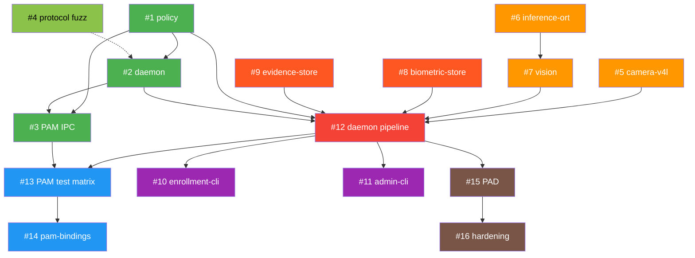

# soos — Complete Development Backlog

Comprehensive issue backlog derived from `ARCHITECTURE.md` §11 implementation phases,
`VERIFICATION_MATRIX.md` acceptance criteria, and gap analysis of current codebase.

> **Generated**: 2026-09-13  
> **Status**: Approved  
> **Execution order**: Critical path #1 → #2 → #3, then parallel phases

---

## Current State Assessment

### ✅ Completed (Foundation)
| Component | Status | Details |
|-----------|--------|---------|
| **Workspace** | ✅ Complete | `resolver="2"`, `deny.toml`, `rust-toolchain.toml` |
| **`protocol` crate** | ✅ Complete | Types, codec v1, round-trip tests, bounded validation |
| **`pam` crate** | ✅ Skeleton | `PAM_IGNORE` stub, `catch_unwind`, C ABI exports |
| **Invariant tests** | ✅ Solid | `forbid(unsafe)`, no-unwrap, no-tokio, no-opencv, no-secrets |
| **CI/CD** | ✅ Complete | GitHub Actions: quality + security + PAM Docker |
| **Tooling** | ✅ Complete | `save.sh`, `run_tests.sh`, `candid_review.sh`, `pr_loop.sh` |
| **Documentation** | ✅ Complete | Architecture, ADR, Mock Strategy, Verification Matrix, 10 walkthroughs |

### 🔴 Remaining (9 crates, all core functionality)
`policy`, `daemon`, `camera-v4l`, `vision`, `inference-ort`, `biometric-store`, `evidence-store`, `enrollment-cli`, `admin-cli`

---

## Phase 1 — Hardened IPC (Foundation → Real Communication)

> **Goal**: Transform the PAM module from a skeleton into a functional IPC client, and create the daemon skeleton that accepts connections.

---

### Issue #1: `policy` Crate — Authorization Logic (Zero I/O)

> **Branch**: `feat/policy-crate`  
> **Architecture ref**: §3 Request State Matrix, §11 Phase 1  
> **VERIFICATION_MATRIX**: PO1, PO2, PO3, PO4

Pure business logic crate: takes structured inputs (score, PAD result, UID context, rate-limit state) and renders a `Verdict`. Zero filesystem, zero network, zero async.

#### Sub-issues:

- [x] **#1.1** — Scaffold `crates/policy/` with `Cargo.toml`, `#![forbid(unsafe_code)]`, workspace membership
  - Acceptance: `PO4` — `forbid(unsafe_code)` invariant test passes
  - Acceptance: `PO3` — zero I/O deps in `Cargo.toml` (no `std::fs`, `std::net`, `tokio`)

- [x] **#1.2** — Implement `AuthorizationDecision` engine
  - Input: `AuthContext { score: f32, pad_passed: bool, face_count: u8, uid: u32, session_valid: bool }`
  - Output: `(Verdict, ReasonClass)` from `protocol` types
  - Rules: `Allow` only if `score >= threshold AND pad_passed AND face_count == 1 AND session_valid`
  - Acceptance: `PO1` — parametric unit tests cover every branch

- [x] **#1.3** — Implement per-UID rate limiter
  - Sliding window or token-bucket, configurable `max_attempts` and `window_secs`
  - Must be `no_std`-compatible (no system clock — accepts monotonic timestamp as parameter)
  - Acceptance: `PO2` — burst test: 10 rapid requests from same UID, only first N pass

- [x] **#1.4** — Implement cosine threshold configuration
  - `ThresholdConfig { match_threshold: f32, pad_threshold: f32 }` with builder pattern
  - Sane defaults documented from MobileFaceNet literature

---

### Issue #2: `daemon` Crate — Socket Listener Skeleton

> **Branch**: `feat/daemon-skeleton`  
> **Architecture ref**: §4 IPC Architecture, §10 Daemon Hardening  
> **VERIFICATION_MATRIX**: D1, D2, D3, D4, D5

#### Sub-issues:

- **#2.1** — Scaffold `crates/daemon/` with `Cargo.toml` (binary crate), add `tokio` workspace dep
  - `[[bin]] name = "soos-daemon"`
  - Dependencies: `tokio`, `soos-protocol`, `soos-policy`, `nix` (for `SO_PEERCRED`)

- **#2.2** — Implement socket lifecycle manager
  - Validate `/run/soos/` ownership (root:soos, not world-writable, not symlink)
  - Unlink stale socket after `lstat` verification
  - Bind `/run/soos/daemon.sock` with mode `0660`
  - Acceptance: `D1` — socket created with correct permissions

- **#2.3** — Implement `SO_PEERCRED` connection handler
  - On every `accept()`: extract `peer.uid`, `peer.pid` via `getsockopt(SO_PEERCRED)`
  - Cross-reference against target UID from request
  - Acceptance: `D2` — spoofed UID test rejects mismatched peer

- **#2.4** — Implement connection dispatcher with bounded concurrency
  - `tokio::sync::Semaphore` capping concurrent connections (configurable, default 8)
  - Per-connection timeout enforcement
  - Read framed request → validate → dispatch to (stubbed) handler → write framed response

- **#2.5** — Implement health check subsystem
  - Internal struct tracking `socket_ready: bool`, `camera_ready: bool`, `models_verified: bool`
  - Exposed via admin socket or structured logging
  - Acceptance: `D4` — health check reports component readiness

- **#2.6** — Create systemd unit file `packaging/soos-daemon.service`
  - Full sandbox: `NoNewPrivileges`, `PrivateTmp`, `ProtectHome`, `ProtectSystem=strict`, `RestrictAddressFamilies=AF_UNIX`, etc.
  - `RuntimeDirectory=soos`, `RuntimeDirectoryMode=0750`
  - Acceptance: `D3` — systemd restrictions active

- **#2.7** — Implement structured logging with sensitive-data filter
  - Log framework: `tracing` + `tracing-subscriber`
  - MUST never log: frames, embeddings, passwords, raw request payloads
  - Log: connection accepted (peer_uid, pid), verdict rendered, error class
  - Acceptance: `D5` — log audit finds zero sensitive information

---

### Issue #3: PAM Module — IPC Client Integration

> **Branch**: `feat/pam-ipc-client`  
> **Architecture ref**: §5 PAM Module, §4 Async Boundaries  
> **VERIFICATION_MATRIX**: PA1, PA2, PA7, PA8

#### Sub-issues:

- **#3.1** — Implement synchronous IPC client in `crates/pam/src/ipc.rs`
  - `std::os::unix::net::UnixStream::connect()` with `set_read_timeout` / `set_write_timeout`
  - Total budget: 200–250ms (configurable via PAM module argument `timeout_ms=250`)
  - Generate `request_id` via `getrandom` crate (no openssl)
  - Send framed `Request`, receive framed `Response`
  - Close socket immediately after response

- **#3.2** — Integrate IPC client into `pam_sm_authenticate`
  - Parse `timeout_ms` from `argv`
  - Connect → send AuthAttempt → receive verdict → map to `PAM_SUCCESS` or `PAM_IGNORE`
  - All errors (connect fail, timeout, malformed response) → `PAM_IGNORE`

- **#3.3** — Implement `event=password-failed` mode
  - When `argv` contains `event=password-failed`: send `Event::PasswordFailed` to daemon (best-effort, fire-and-forget)
  - 20ms timeout, zero blocking of PAM stack
  - Used in 3rd position of PAM stack (after `pam_unix` failure)

- **#3.4** — Dockerized pamtester validation
  - T1: `.so` loadable by Linux-PAM → `pamtester` reports module found
  - T2: `pam_sm_authenticate` returns `PAM_IGNORE` when daemon is offline → password prompt works
  - T3: Removing `.so` from PAM config → auth still works (non-interference)
  - Acceptance: `PA1`, `PA7`, `PA8`

---

### Issue #4: Protocol Fuzzing

> **Branch**: `test/protocol-fuzzing`  
> **Architecture ref**: VERIFICATION_MATRIX P5

#### Sub-issues:

- **#4.1** — Add `cargo-fuzz` harness for `decode::<Request>`
  - Feed arbitrary bytes, assert zero panics over 10M iterations
  - Acceptance: `P5`

- **#4.2** — Add `cargo-fuzz` harness for `decode::<Response>`
  - Same coverage target

- **#4.3** — Add `proptest` round-trip property test
  - Generate arbitrary valid `Request` values → encode → decode → assert equality

---

## Phase 2 — Camera Pipeline

> **Goal**: Warm V4L2 MMAP streaming with mock support for CI.

---

### Issue #5: `camera-v4l` Crate — V4L2 Capture Manager

> **Branch**: `feat/camera-v4l`  
> **Architecture ref**: §6 Warm Camera Streaming  
> **VERIFICATION_MATRIX**: C1, C2, C3, C4, C5

#### Sub-issues:

- **#5.1** — Scaffold `crates/camera-v4l/` with `Cargo.toml`
  - Dependencies: `v4l = "0.14"`, `arc-swap`
  - Feature flag: `mock-camera = []`

- **#5.2** — Define `CameraManager` trait
  - `fn latest_frame(&self) -> Option<Arc<Frame>>`
  - `fn is_ready(&self) -> bool`
  - `Frame` struct: `data: Vec<u8>`, `width: u32`, `height: u32`, `timestamp_mono_ns: u64`, `format: PixelFormat`

- **#5.3** — Implement `V4lCameraManager` (production)
  - Open device by `/dev/v4l/by-id/...` path (configurable)
  - MMAP streaming with buffer rotation
  - Dedicated blocking thread, `ArcSwap<Frame>` for lock-free reads
  - Discard first 15–30 frames for auto-exposure stabilization
  - Acceptance: `C4`, `C5`

- **#5.4** — Implement `MockCameraManager` (behind `mock-camera` feature)
  - Generate static 640×480 test frames with monotonic timestamps
  - Simulate device errors: `ENODEV`, `EIO`, `EBUSY`
  - Simulate frame starvation (no new frame for N ms)
  - Acceptance: `C1`

- **#5.5** — Implement error recovery with bounded backoff
  - Handle `ENODEV` / `EIO` / `EBUSY` without panic
  - Exponential backoff: 100ms → 200ms → 400ms → cap at 5s
  - Report `Unavailable` to IPC during recovery
  - Acceptance: `C3`

- **#5.6** — Implement idle power management
  - Drop to 5 FPS after 60s of inactivity
  - Resume full FPS on next auth request
  - Acceptance: `C2` (frame available in < 5ms via `ArcSwap`)

---

## Phase 3 — Vision Engine

> **Goal**: Full face detection → alignment → embedding → matching pipeline.

---

### Issue #6: `inference-ort` Crate — ONNX Runtime Wrapper

> **Branch**: `feat/inference-ort`  
> **Architecture ref**: §7 Vision Pipeline

#### Sub-issues:

- **#6.1** — Scaffold `crates/inference-ort/` with `Cargo.toml`
  - Dependencies: `ort = "2.0"` (CPU execution provider only)
  - NO OpenCV dependency (invariant test)

- **#6.2** — Implement `ModelRegistry` with manifest verification
  - Parse `models/manifest.toml`: model ID, license, source URL, SHA-256 checksum
  - Verify checksums at daemon startup before loading any session
  - Acceptance: Global invariant — ONNX model attested by manifest + SHA-256

- **#6.3** — Implement `FaceDetector` (UltraFace Slim 320)
  - Input: raw pixel buffer (RGB, 320×240 or 640×480)
  - Output: `Vec<BoundingBox>` with confidence scores
  - Deterministic Rust NMS (Non-Maximum Suppression)

- **#6.4** — Implement `LandmarkDetector` (5-point landmarks)
  - Input: face crop from bounding box
  - Output: 5 landmark points (eye centers, nose tip, mouth corners)

- **#6.5** — Implement `EmbeddingExtractor` (MobileFaceNet)
  - Input: aligned 112×112 face crop
  - Output: L2-normalized 128D or 512D embedding vector
  - Acceptance: `V2` — norm ≈ 1.0 for all outputs

- **#6.6** — Create `models/manifest.toml` with checksums
  - UltraFace Slim 320 ONNX
  - 5-point landmark ONNX
  - MobileFaceNet ArcFace ONNX
  - Document license, source URL, expected input/output shapes

---

### Issue #7: `vision` Crate — Preprocessing & Matching

> **Branch**: `feat/vision-crate`  
> **Architecture ref**: §7 Models & Verification Pipeline  
> **VERIFICATION_MATRIX**: V1, V2, V3, V4, V5, V6

#### Sub-issues:

- **#7.1** — Scaffold `crates/vision/` with `Cargo.toml`, `#![forbid(unsafe_code)]`
  - Dependencies: `soos-inference-ort`, `soos-protocol`
  - Acceptance: `V6` — `forbid(unsafe_code)` enforced

- **#7.2** — Implement color conversion (YUYV/MJPEG → RGB)
  - Pure Rust, no OpenCV
  - Support common V4L2 output formats

- **#7.3** — Implement affine alignment from 5-point landmarks
  - Standard alignment transform → 112×112 crop
  - Golden test fixtures: known input image → expected aligned output
  - Acceptance: `V1` — golden tests match training pipeline

- **#7.4** — Implement cosine similarity matcher
  - `fn cosine_similarity(a: &[f32], b: &[f32]) -> f32`
  - Known-vector distance tests with precomputed expected values
  - Acceptance: `V3` — correctness verified

- **#7.5** — Implement `VisionPipeline` orchestrator
  - detect → count faces → align → extract embedding → match
  - Reject if 0 or > 1 face detected
  - Acceptance: `V4` — rejection tests for 0 and multi-face

- **#7.6** — Benchmark: full pipeline < 150ms p95
  - On reference hardware (document specs)
  - Acceptance: `V5` — latency budget met

- **#7.7** — Create test fixtures in `tests/fixtures/`
  - Sample facial images (known subjects, unknown subjects)
  - Pre-computed embeddings for regression testing
  - Multi-face and no-face images for rejection tests

---

## Phase 4 — Storage & Evidence

> **Goal**: Encrypted persistence for biometric templates and intrusion evidence.

---

### Issue #8: `biometric-store` Crate — Encrypted Embeddings

> **Branch**: `feat/biometric-store`  
> **Architecture ref**: §9 Privacy & Persistence  
> **VERIFICATION_MATRIX**: B1, B2, B3, B4

#### Sub-issues:

- **#8.1** — Scaffold `crates/biometric-store/` with `Cargo.toml`
  - Dependencies: `aes-gcm`, `serde`, `cbor`, `zeroize`

- **#8.2** — Implement AES-GCM encryption/decryption for embeddings
  - Key derivation from daemon master key (or hardware-backed key)
  - Unique nonce per template write
  - Acceptance: `B1` — encrypted at rest

- **#8.3** — Implement file storage at `/var/lib/soos/biometrics/<uid>.cbor.enc`
  - Mode `0600`, owner `root:root`
  - Atomic writes (write to `.tmp` → `rename`)
  - Acceptance: `B2` — permissions correct

- **#8.4** — Implement metadata storage with each template
  - `model_id`, `model_version`, `enrollment_timestamp`, `embedding_dim`
  - Acceptance: `B3` — model version tracked for migration

- **#8.5** — Implement CRUD operations
  - Enroll (create/replace), verify (read + compare), delete, list enrolled UIDs
  - Acceptance: `B4` — full CRUD tested

- **#8.6** — Implement zeroization on drop
  - All decrypted embedding vectors use `Zeroizing<Vec<f32>>`
  - Raw frames deleted immediately after extraction

---

### Issue #9: `evidence-store` Crate — Anti-Intrusion Snapshots

> **Branch**: `feat/evidence-store`  
> **Architecture ref**: §9 Evidence Snapshots  
> **VERIFICATION_MATRIX**: E1, E2, E3, E4, E5

#### Sub-issues:

- **#9.1** — Scaffold `crates/evidence-store/` with `Cargo.toml`

- **#9.2** — Implement opt-in configuration
  - Disabled by default in daemon config
  - Acceptance: `E1` — disabled by default

- **#9.3** — Implement encrypted evidence storage
  - Path: `/var/lib/soos/evidence/YYYY-MM-DD/<uuid>.webp.enc`
  - Mode `0600`, owner `root:root`
  - Acceptance: `E4` — correct permissions

- **#9.4** — Implement 7-day retention rotation
  - Cron-like cleanup: delete evidence directories older than 7 days
  - Acceptance: `E2` — automatic rotation

- **#9.5** — Implement per-UID daily cap
  - Configurable max snapshots per UID per day (default: 10)
  - Acceptance: `E3` — daily cap enforced

- **#9.6** — Ensure zero network transmission
  - No network dependency in `Cargo.toml`
  - Invariant test: crate has no `std::net`, no `tokio::net`, no `reqwest`
  - Acceptance: `E5` — dependency audit passes

---

## Phase 5 — Enrollment & Admin CLI

> **Goal**: User-facing tools for enrollment and system diagnostics.

---

### Issue #10: `enrollment-cli` — Root Enrollment Tool

> **Branch**: `feat/enrollment-cli`  
> **Architecture ref**: §8 Monorepo Structure

#### Sub-issues:

- **#10.1** — Scaffold `crates/enrollment-cli/` with `Cargo.toml` (binary)
  - Dependencies: `clap`, `soos-protocol`, `soos-biometric-store`, `soos-inference-ort`, `soos-camera-v4l`

- **#10.2** — Implement `enroll` command
  - Must be run as root
  - Capture N frames → select best quality → extract embedding → encrypt → store
  - Interactive confirmation with enrollment summary

- **#10.3** — Implement `delete` command
  - Delete enrollment for specified UID
  - Secure erasure of stored template

- **#10.4** — Implement `verify` command (diagnostic)
  - One-shot capture → detect → match against stored template
  - Report: score, face count, PAD result, latency breakdown

- **#10.5** — Implement `list` command
  - List all enrolled UIDs with enrollment metadata (date, model version)

---

### Issue #11: `admin-cli` — Non-Biometric Diagnostics

> **Branch**: `feat/admin-cli`  
> **Architecture ref**: §8 Monorepo Structure

#### Sub-issues:

- **#11.1** — Scaffold `crates/admin-cli/` with `Cargo.toml` (binary)

- **#11.2** — Implement `status` command
  - Query daemon health check: socket_ready, camera_ready, models_verified
  - Report daemon PID, uptime, systemd unit state

- **#11.3** — Implement `test-pam` command
  - Simulate a PAM authentication cycle without affecting the real PAM stack
  - Report: connection latency, daemon response time, verdict

- **#11.4** — Implement `logs` command
  - Filtered view of daemon journal logs (via `journalctl`)
  - Redact any sensitive fields

---

## Phase 6 — Daemon Integration (Wiring Everything Together)

> **Goal**: Connect all crates into the running daemon binary.

---

### Issue #12: Daemon Full Pipeline Integration

> **Branch**: `feat/daemon-pipeline`  
> **Architecture ref**: §3 System Architecture, §7 Latency Budget

#### Sub-issues:

- **#12.1** — Integrate `CameraManager` into daemon startup
  - Initialize camera (or mock) on dedicated thread
  - Report readiness to health check subsystem

- **#12.2** — Integrate `VisionPipeline` as request handler
  - On auth request: grab latest frame → run full pipeline → render verdict
  - Enforce 150ms decision budget with deadline propagation

- **#12.3** — Integrate `BiometricStore` for template loading
  - Load enrolled templates for target UID on auth request
  - Handle missing enrollment gracefully (→ `Unavailable`)

- **#12.4** — Integrate `EvidenceStore` for intrusion capture
  - On `PasswordFailed` event: if opt-in enabled, capture and encrypt current frame
  - Enforce daily cap and retention policy

- **#12.5** — Integrate `Policy` engine for verdict rendering
  - Wire pipeline outputs (score, PAD, face_count) into `AuthorizationDecision`
  - Apply rate limiting per UID

- **#12.6** — End-to-end integration test
  - Mock camera + real codec + real policy → verify full request/response cycle
  - Test all 4 verdict paths: Allow, Deny, Unavailable, ProtocolError

---

## Phase 7 — PAM Validation & Distribution

> **Goal**: Validate PAM integration across distributions and failure scenarios.

---

### Issue #13: Full PAM Docker Test Matrix

> **Branch**: `test/pam-full-matrix`  
> **Architecture ref**: §5 Distribution Adaptation, §11 Phase 5  
> **VERIFICATION_MATRIX**: PA2

#### Sub-issues:

- **#13.1** — Dockerized test: `pam_soos.so` loaded + daemon running → facial auth succeeds (mock camera)
- **#13.2** — Dockerized test: daemon timeout > 250ms → `PAM_IGNORE` → password fallback
- **#13.3** — Dockerized test: daemon crashes mid-request → `PAM_IGNORE`
- **#13.4** — Dockerized test: Debian/Ubuntu PAM stack integration
- **#13.5** — Dockerized test: RHEL/Fedora PAM stack integration
- **#13.6** — Dockerized test: Arch Linux PAM stack integration

---

### Issue #14: PAM Module `pam-bindings` Migration

> **Branch**: `feat/pam-bindings-migration`  
> **Architecture ref**: §5 Crate and ABI

#### Sub-issues:

- **#14.1** — Migrate from raw C ABI exports to `pam-bindings` 0.3.0
  - Implement `PamHooks` trait
  - Maintain `catch_unwind` wrapping

- **#14.2** — Implement syslog logging on caught panics
  - Log panic location and backtrace summary to syslog
  - NEVER log request content or user data

---

## Phase 8 — PAD & Production Hardening

> **Goal**: Presentation Attack Detection and production-grade security.

---

### Issue #15: Presentation Attack Detection (PAD)

> **Branch**: `feat/pad-liveness`  
> **Architecture ref**: §7 step 3

#### Sub-issues:

- **#15.1** — Research and select PAD model (ONNX anti-spoofing)
  - Evaluate: printed photo, smartphone screen, recorded video detection
  - Add to `models/manifest.toml` with checksum

- **#15.2** — Integrate PAD into vision pipeline
  - Insert between alignment and embedding extraction
  - PAD failure → `Deny` with `ReasonClass::PadFailed`

- **#15.3** — PAD test fixtures
  - Real face images vs. screen photos vs. printed photos
  - Benchmark false-accept and false-reject rates

---

### Issue #16: Production Hardening

> **Branch**: `chore/production-hardening`

#### Sub-issues:

- **#16.1** — Memory zeroization audit
  - Verify all decrypted embeddings use `Zeroizing<T>`
  - Verify raw frames are dropped after pipeline completion
  - Verify key material is zeroized on daemon shutdown

- **#16.2** — Swap protection
  - Document `mlock` strategy for sensitive pages
  - Implement for embedding and key buffers

- **#16.3** — Systemd hardening validation
  - Test all sandbox directives in `soos-daemon.service`
  - Verify `MemoryDenyWriteExecute`, `RestrictSUIDSGID`, `SystemCallArchitectures=native`

- **#16.4** — `cargo-deny` audit enforcement
  - Verify license compliance for all transitive deps
  - Ban known-vulnerable advisories
  - Block duplicate dependency versions

---

## Issue Dependency Graph

**Legend**: 🟢 Phase 1 (IPC) → 🟠 Phase 2-3 (Camera+Vision) → 🔴 Phase 4 (Storage) → 🟣 Phase 5 (CLI) → 🔵 Phase 6-7 (Integration) → 🟤 Phase 8 (Production)

---

## Recommended Execution Order

> Each issue follows the mandatory 4-phase TDD cycle: **Architect → Tester → Auditor → Developer**.
> Each issue = 1 topic branch → 1 PR → squash-merge via `save.sh --auto-merge`.

| Priority | Issue | Est. Complexity | Prerequisite |
|----------|-------|----------------|--------------|
| 🔥 P0 | #1 `policy` crate | Medium | None |
| 🔥 P0 | #4 Protocol fuzzing | Low | None |
| 🔥 P1 | #2 `daemon` skeleton | High | #1 |
| 🔥 P1 | #3 PAM IPC client | High | #1, #2 |
| 🔶 P2 | #5 `camera-v4l` | High | None (parallel) |
| 🔶 P2 | #6 `inference-ort` | High | None (parallel) |
| 🔶 P2 | #7 `vision` pipeline | High | #6 |
| 🔷 P3 | #8 `biometric-store` | Medium | None (parallel) |
| 🔷 P3 | #9 `evidence-store` | Medium | None (parallel) |
| 🔷 P3 | #10 `enrollment-cli` | Medium | #5, #6, #7, #8 |
| 🔷 P3 | #11 `admin-cli` | Low | #2 |
| ⚫ P4 | #12 Daemon integration | Very High | #1-9 |
| ⚫ P4 | #13 PAM test matrix | High | #3, #12 |
| ⚫ P5 | #14 `pam-bindings` migration | Medium | #13 |
| ⚫ P5 | #15 PAD liveness | High | #6, #7 |
| ⚫ P5 | #16 Production hardening | Medium | All above |
